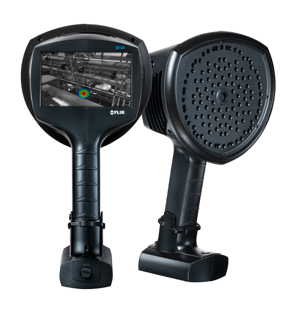
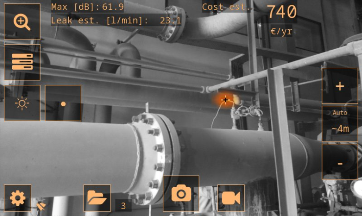

# Compressed Air Energy Cost Reduction Proposal

## Executive Summary
This proposal addresses unquantified energy loss across the manufacturing floor by identifying and repairing compressed air leaks. By transitioning from a poorly maintained system (30% air loss) to a well-maintained standard (10% air loss), the facility can achieve significant annual utility savings.

---

## The Cost of Inefficiency
Compressed air cost is primarily driven by **system efficiency**. Using the [FLUKE estimation tool](https://www.fluke.com/en-us/learn/tools-calculators/air-leakage-calculator), the following baseline was established for the Howell plant:

| Metric | Value |
| :--- | :--- |
| **Total Compressor Power** | 2,850 HP |
| **Operating Hours** | 7,406 hr/y |
| **Electricity Cost** | $0.09/kWh |
| **Total Annual Compressed Air Cost** | **$1,180,467** |
| **Annual Cost of Leaks (at 30% loss)** | **$354,140** |

---

## The Solution: Acoustic Imaging
Finding inaudible leaks in a large plant is nearly impossible without specialized sensors. I proposed the implementation of the **FLIR Si124-LD Plus** acoustic imaging device.

  

*Figure 1: The FLIR Si124-LD Plus allows for detection from up to 130m (430ft).*

### **Device Capabilities:**
* **Max Sensing Range:** 130m (430ft).
* **Real-time Imaging:** Visualizes gas leaks on a touch-screen interface.
* **Quantification:** Automatically identifies and estimates the volume of gas being lost.

  

*Figure 2: Sample interface showing real-time leak cost estimation and data logging.*

---

## ROI and Success Metrics
By reducing leaks from 30% down to 10%, we project the following financial outcomes:

* **Estimated Annual Savings:** **$236,093.33**.
* **Device ROI:** **Less than 1 month** (Unit Cost at Time of Purchase: $8,799).

### **Sustained Maintenance Schedule:**
To reach and maintain the 10% efficiency mark, a standardized audit schedule was developed:
* **Year 1:** Quarterly audits to reduce the backlog of existing leaks.
* **Successive Years:** Bi-annual audits (Q1 & Q3) for sustained energy savings.

---

## Beyond Energy: Secondary Benefits
Implementing this technology provides value across multiple departments, including Press, Assembly, and General Affairs Maintenance:

1. **Quality Control:** Leak checking and auditing new equipment as it is built.
2. **Operational Efficiency:** Improved speed and reliability of pneumatic clamps and cylinders.
3. **Predictive Maintenance:** Early detection of premature component failure.
4. **Labor Savings:** Massive reduction in the time required to find and verify leaks.

