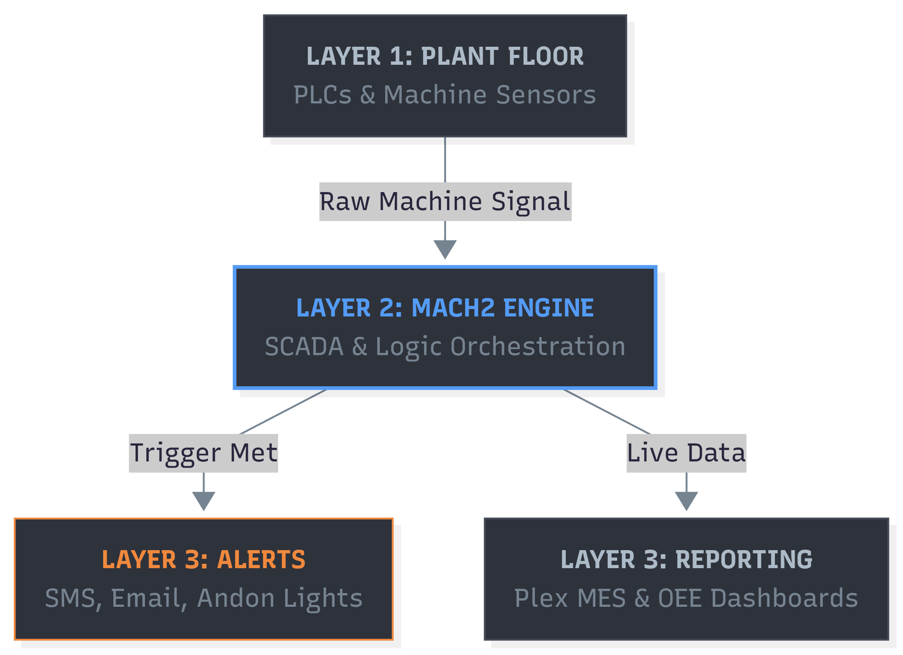

# Mach2 SCADA Implementation: Real-Time Operational Intelligence

## Executive Summary
This proposal outlines the deployment of **Mach2 SCADA** to bridge the gap between PLC-level events and actionable management data. By centralizing automated alerts for quality bypasses, major downtime, and production bottlenecks, we can transition from "after-the-fact" reporting to real-time operational intervention, significantly reducing scrap costs and Mean Time to Repair (MTTR).

---

## The Cost of Information Lag
Currently, critical floor events—such as safety bypasses or micro-stops—are recorded manually or discovered during end-of-shift audits. This delay creates a "blind spot" in operational oversight.

| Impact Category | Current State (Manual/Reactive) | Future State (Mach2 Automated) |
| :--- | :--- | :--- |
| **Quality Risk** | Bypassed checks discovered post-production. | **Instant Notification** upon bypass attempt. |
| **Downtime Response** | 15–20 min lag in maintenance notification. | **Instant Alerts** for events >5 minutes. |
| **Data Accuracy** | Subjective/Handwritten operator logs. | **Hard PLC Data** (Time-stamped & Objective). |
| **Response Latency** | High (Human Dependent) | **Low (System Driven)** |

---

## The Solution: Mach2 SCADA Integration
Mach2 acts as the Supervisor sitting above the PLC layer, polling data from the shop floor and distributing it via a centralized notification engine.

  
*Figure 1: Mach2 integrates directly with PLC registers to visualize shop-floor health.*

### **Core Functionalities:**
* **Bypass Detection:** Monitors "Force" bits and manual interlock overrides in the PLC code, triggering an immediate Quality Alert.
* **Smart Downtime Escalation:** Automatically pings maintenance via Email/Zoom if a machine remains in a "Faulted" state beyond a defined threshold.

---

## ROI and Success Metrics
The Mach2 implementation focuses on "Time-to-Value," leveraging existing network infrastructure to drive immediate savings.

* **Estimated Efficiency Gain:** **5–8% increase in OEE** through reduced response times.
* **Scrap Reduction:** Reduced chargebacks and frequent scrap by catching quality bypasses before parts leave the cell.

### **Implementation Timeline:**
* **Phase 1:** Driver configuration and PLC tag mapping
* **Phase 2:** Alert logic and escalation matrix setup.
* **Phase 3:** Dashboard rollout and PowerBI integration.

---

## Beyond Alarms: Strategic Benefits
Implementing Mach2 provides a foundation for a data-driven manufacturing culture:

1. **Accountability:** Clear, timestamped logs of when systems were bypassed and for what duration.
2. **Predictive Analytics:** Identifying "nuisance trips" that precede a major mechanical failure.
3. **Bottleneck Identification:** Quantifying exactly where production "stutters" occur across multiple shifts.
4. **Labor Optimization:** Maintenance can prioritize the highest-impact faults rather than wandering the floor.

---
> *Note: Implementation requires coordination with IT for server allocation and Plant Engineering for PLC tag accessibility. All data will be hosted on the internal secure network.*
